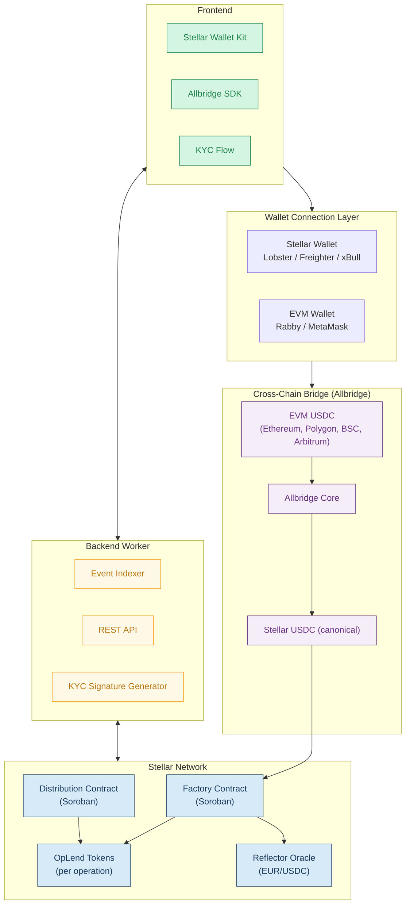
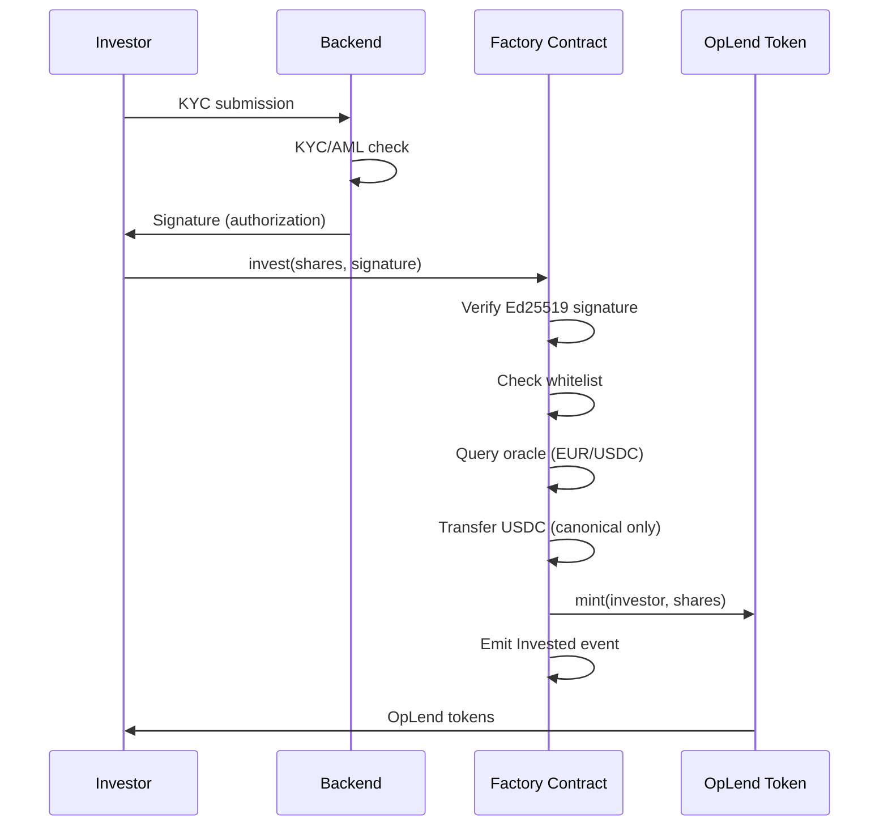
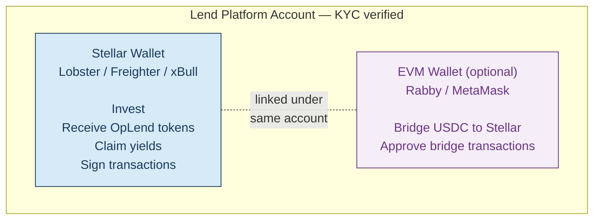
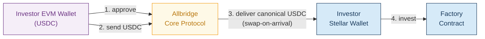
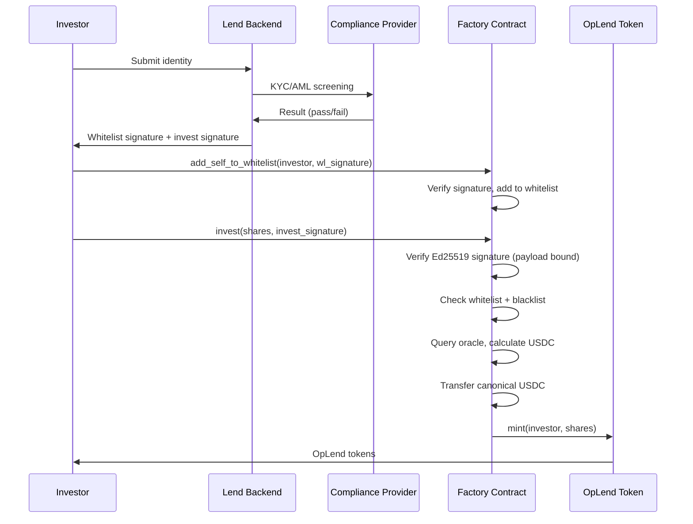
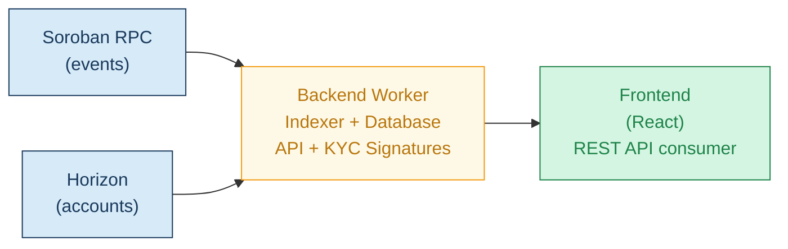
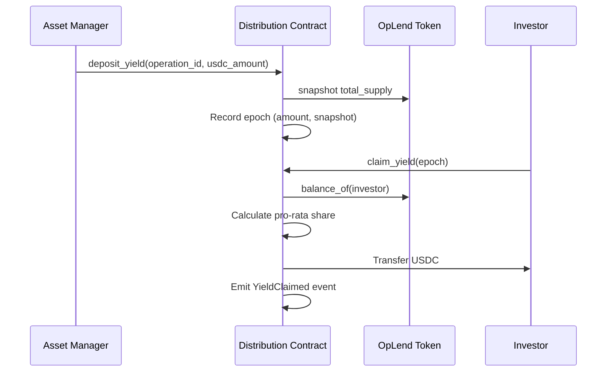
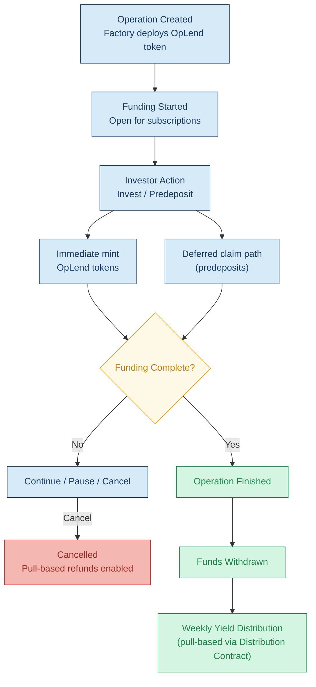

# Technical Architecture — Lend Protocol on Stellar

Lend is a compliant real estate tokenization protocol deployed on Stellar using Soroban smart contracts. The protocol enables investors to deploy stablecoins into professionally structured real estate operations, with programmable yield distribution and secondary market liquidity.

This document describes the full technical architecture of the Stellar integration.

---

## System Overview



---

## 1. Smart Contracts (Soroban)

### 1.1 Factory Contract

The Factory is the primary entry point of the protocol. It orchestrates the full lifecycle of tokenized investment operations.

**Responsibilities:**

- Create tokenized operations (deploy a new OpLend token contract per operation)
- Manage funding state (open, pause, cancel, complete)
- Process investor subscriptions with backend signature verification
- Handle pre-deposits and token claims
- Execute cancellation and enable pull-based investor refunds
- Enable fund withdrawal by the operation issuer
- Manage whitelist/blacklist for investor compliance
- Emit protocol events for off-chain indexing

**Key functions:**

| Function | Description | Access |
|----------|-------------|--------|
| `create_operation` | Deploy new OpLend token, register operation | Admin |
| `start_operation` | Open funding to investors | Admin |
| `pause_operation` | Pause funding temporarily | Admin |
| `unpause_operation` | Resume funding after pause | Admin |
| `invest` | Subscribe to operation (requires backend signature) | Investor (whitelisted) |
| `predeposit` | Reserve shares before operation starts | Investor (whitelisted) |
| `claim_tokens` | Claim OpLend tokens from predeposit | Investor |
| `cancel_operation` | Cancel operation, mark as refundable | Admin |
| `refund` | Pull-based: investor claims refund after cancellation | Investor |
| `withdraw_funds` | Withdraw raised capital to destination | Admin |
| `add_to_whitelist` | Authorize an address for protocol interactions | Admin |
| `remove_from_whitelist` | Revoke address authorization | Admin |
| `add_to_blacklist` | Block an address from all protocol interactions | Admin |
| `remove_from_blacklist` | Unblock a previously blacklisted address | Admin |
| `set_oracle_adapter` | Update the Reflector oracle adapter address | Admin |
| `set_signer` | Rotate the backend signer public key | Admin (timelocked) |
| `transfer_admin` | Transfer admin role to a new address | Admin (timelocked) |
| `force_transfer` | Move tokens from a delisted holder to escrow | Admin |

**Investment flow — signature verification:**



#### 1.1.1 Signature Scheme

Every investment requires a cryptographic signature generated by the backend after KYC/AML verification. The signature binds to a specific payload to prevent replay, front-running, and exploitation around oracle price movements.

**Signature payload:**

```
Ed25519_sign(sha256(
    operation_id     || // Target operation
    investor_address || // Stellar address of the investor
    shares           || // Number of shares authorized
    max_usdc_amount  || // Maximum USDC the investor agrees to pay
    nonce            || // Unique per-signature, prevents replay
    expiry           || // Unix timestamp after which the signature is invalid
    chain_id            // Stellar network passphrase hash (testnet vs mainnet)
))
```

**On-chain verification:** The Factory contract verifies the signature using `env.crypto().ed25519_verify()` against the stored backend signer public key. The public key is stored in Instance storage and can only be rotated via the timelocked `set_signer` function.

**Replay protection:** Each nonce is recorded on-chain after use. A signature with a previously used nonce is rejected. Expired signatures (past `expiry` timestamp) are also rejected.

**`max_usdc_amount` binding:** The signature commits to a maximum USDC amount the investor agrees to pay. If the oracle price moves between signature generation and on-chain execution such that the required USDC exceeds `max_usdc_amount`, the transaction reverts. This protects investors from unfavorable price slippage.

#### 1.1.2 USDC Asset Validation

The Factory contract **only accepts canonical Circle-issued USDC** on Stellar:

- **Issuer:** `GA5ZSEJYB37JRC5AVCIA5MOP4RHTM335X2KGX3IHOJAPP5RE34K4KZVN`
- The issuer address is hardcoded in the Factory contract at deployment
- Any attempt to invest with a different USDC variant (including Allbridge-wrapped tokens) is rejected

If Allbridge produces a wrapped USDC variant on arrival, the frontend integrates Allbridge's swap-on-arrival feature to convert to canonical USDC before the investment transaction. The investor never holds wrapped USDC.

#### 1.1.3 Refund Pattern (Pull-Based)

When an operation is cancelled via `cancel_operation`, the Factory marks the operation as refundable but **does not push USDC back to investors**. Instead:

1. Admin calls `cancel_operation` — sets operation status to `Cancelled`
2. Each investor calls `refund(operation_id)` at their own pace
3. The Factory calculates the refund amount based on the investor's recorded position
4. USDC is transferred from the Factory to the investor's wallet
5. The investor's position is cleared

This pull-based pattern avoids compute limits on mass refunds, handles archived accounts gracefully (the investor must restore their account before claiming), and does not fail silently for wallets missing a USDC trustline.

### 1.2 OpLend Token Contract (SEP-41)

Each real estate operation deploys a dedicated OpLend token representing investor shares in the financing structure.

**Interface:** Implements the Soroban Token Interface ([SEP-41](https://github.com/stellar/stellar-protocol/blob/master/ecosystem/sep-0041.md)).

**Standard functions (9):** `balance`, `transfer`, `transfer_from`, `approve`, `allowance`, `decimals`, `name`, `symbol`, `total_supply`

**Admin functions (6):**

| Function | Description |
|----------|-------------|
| `set_admin` | Transfer token admin role |
| `mint` | Mint new tokens (called by Factory on investment) |
| `burn` | Burn tokens (redemption, cancellation) |
| `set_whitelist` | Add/remove addresses from transfer whitelist |
| `set_blacklist` | Add/remove addresses from transfer blacklist |
| `pause` | Emergency pause all token transfers |

**Compliance features:**

- **Whitelist-based transfers:** Only whitelisted addresses can send and receive tokens
- **Blacklist enforcement:** Blocked addresses cannot interact with the token
- **Capped supply:** Total supply is hard-capped to the operation's funding target
- **Transfer restrictions:** All transfers validated against compliance rules before execution

**KYC expiry recovery:** If an investor's KYC expires and they are removed from the whitelist, they cannot transfer their tokens — including back to the protocol. To handle this, the Factory exposes a `force_transfer` admin function that moves tokens from a delisted holder to a designated escrow address. The off-chain refund process is then handled by Lend's compliance team. This ensures no investor's capital is permanently locked due to KYC status changes.

**Storage model:**

| Data | Storage Type | TTL Strategy | Rationale |
|------|-------------|--------------|-----------|
| Admin, config | Instance | Auto-extended by any contract call | Shared across all calls, high access frequency |
| Investor balances | Persistent | Extended on every `transfer`, `claim`, `mint` interaction. Permissionless `extend_ttl(holder)` function available. | Must survive archival, per-user data. Multi-year bonds require proactive rent management. |
| Allowances | Persistent | Extended on every `transfer_from` call. Maximum allowance lifetime: 7 days, enforced at application layer. | Moved from Temporary to Persistent to prevent silent expiry that would break transfers for custodians and distribution operators. |

**Rent payment strategy:** Soroban Persistent storage requires periodic TTL extension (~1 year before archival). The protocol addresses this through:
1. **Automatic extension:** Every balance-changing operation (`transfer`, `mint`, `claim_yield`) calls `extend_ttl` on the holder's balance entry
2. **Permissionless extension:** A public `extend_ttl(holder)` function allows anyone (protocol bot, investor, third party) to pay rent for any holder's balance entry
3. **Protocol bot:** An automated backend process monitors TTL across all active holders and extends storage before expiry

### 1.3 Oracle Integration (Reflector)

Operations are priced in EUR while investors settle in USDC. The Factory integrates [Reflector](https://reflector.network/), Stellar's native oracle network, to dynamically convert share prices.

**Oracle contract:** The Factory consumes the Reflector FX oracle feed for the EUR/USD pair. The oracle adapter contract address is stored in Factory Instance storage and configured at deployment. Asset symbol queried: `EUR` against base `USD`, with standard 14-decimal precision as per Reflector's FX feed specification.

**Flow:**

1. Operation share price is defined in EUR at creation
2. When an investor subscribes, the Factory queries the Reflector oracle adapter for the current EUR/USDC rate
3. The required USDC amount is calculated using fixed-point arithmetic (see below)
4. The investor transfers the calculated USDC amount

**Conversion math and rounding:**

EUR is conventionally 2 decimal places; USDC on Stellar uses 7 decimals. To avoid systematic rounding errors:

1. All intermediate values are scaled to **18-decimal fixed-point** representation
2. Calculation: `usdc_amount = shares × price_per_share_eur_18d × eur_usdc_rate_18d / 10^18`
3. Final USDC amount is **rounded UP** (ceiling), so the protocol never under-collects
4. Rounding direction is enforced at the contract level and validated by unit tests across boundary inputs

**Staleness and deviation policy:**

| Parameter | Value | Rationale |
|-----------|-------|-----------|
| Staleness threshold | **600 seconds** (default) | ~2x Reflector's publication cadence (~300s). Configurable via admin. |
| Price deviation bounds | **2%** max between simulation and execution | Protects against oracle manipulation between tx simulation and on-chain execution |
| Fallback behavior | Factory **pauses** new subscriptions | Does not fall back to a stale price. Subscriptions resume automatically on next valid oracle update. |

If the oracle data timestamp is older than the staleness threshold, `invest()` reverts with an explicit `OracleStale` error. The Factory does not use stale prices under any circumstance.

**Implementation:**

```mermaid
graph LR
    FC["Factory Contract<br/>EUR amount requested"] -->|query price| OA["Oracle Adapter<br/>(Soroban)"]
    OA -->|fetch rate| RF["Reflector Network<br/>FX Feed — EUR/USD"]
    RF -->|EUR/USDC rate<br/>14-decimal precision| OA
    OA -->|USDC amount<br/>(rounded up)| FC

    classDef stellar fill:#d6eaf8,stroke:#1a3a5c,color:#1a3a5c
    class FC,OA,RF stellar
```

---

## 2. Dual-Wallet Architecture

A key differentiator of the Lend protocol is the ability for investors to connect both a Stellar wallet and an EVM wallet under a single platform account. This enables cross-chain capital onboarding while keeping investment settlement on Stellar.

### 2.1 Wallet Connection

**Stellar wallet:**
- Connected via [Stellar Wallet Kit](https://stellarwalletskit.dev/)
- Supported wallets: Lobster, Freighter, xBull
- Used for: investing in operations, receiving OpLend tokens, claiming yields

**EVM wallet:**
- Connected via standard Web3 provider (Rabby, MetaMask)
- Used for: bridging USDC from EVM chains to Stellar via Allbridge

**Account linking:**



Both wallets are linked to the same KYC-verified identity. The Stellar wallet is the primary wallet that receives OpLend tokens and weekly yield distributions. The EVM wallet is optional and used exclusively for cross-chain capital bridging.

### 2.2 User Flows

**Flow A — Stellar-native investor:**

1. Connect Stellar wallet via Stellar Wallet Kit
2. Complete KYC verification on platform
3. Browse available real estate operations
4. Invest USDC directly from Stellar wallet
5. Receive OpLend tokens representing investment position
6. Claim weekly yield distributions from Distribution contract

**Flow B — Cross-chain investor (EVM -> Stellar):**

1. Connect Stellar wallet via Stellar Wallet Kit
2. Connect EVM wallet via Web3 provider (Rabby, MetaMask)
3. Complete KYC verification on platform
4. Browse available real estate operations
5. Select investment amount — platform calculates USDC needed
6. Approve USDC on EVM chain
7. Allbridge bridges USDC from EVM to investor's Stellar wallet (canonical USDC via swap-on-arrival)
8. Factory contract processes investment from Stellar wallet
9. Receive OpLend tokens on Stellar wallet
10. Claim weekly yield distributions from Distribution contract

**Bridge failure recovery:** If the bridge transaction times out or fails (USDC stuck on EVM, slippage rejection), the investor sees a status page displaying the bridge transaction ID with options to: retry the bridge, request a refund through Allbridge, or contact Lend support. Bridge failures do not affect the investor's KYC status or whitelist position.

**Key principle:** The bridge is a one-way capital onboarding mechanism. Once USDC arrives on Stellar, all subsequent operations (investment, yield distribution, token transfers) happen natively on Stellar.

---

## 3. Cross-Chain Bridge (Allbridge Core)

### 3.1 Architecture

Allbridge Core is integrated to enable USDC transfers from EVM chains into Stellar. The bridge flow is embedded directly in the Lend frontend, presenting a seamless single-session experience.

**Supported source chains:** Ethereum, Polygon, BSC, Arbitrum

**USDC handling:** Allbridge bridges USDC from EVM chains to Stellar. The Factory contract only accepts canonical Circle-issued USDC (issuer `GA5ZSEJYB37JRC5AVCIA5MOP4RHTM335X2KGX3IHOJAPP5RE34K4KZVN`). If Allbridge delivers a wrapped variant, the swap-on-arrival feature converts it to canonical USDC before the investment step.

**Bridge flow:**



### 3.2 Frontend Integration

The Allbridge SDK is integrated into the Lend frontend. The user experience is:

1. User selects an operation and investment amount
2. If paying from EVM: connect EVM wallet, approve USDC, initiate bridge
3. Frontend displays bridge progress with status updates
4. Once USDC arrives on Stellar, the investment transaction is prepared
5. User signs the Stellar transaction via Stellar Wallet Kit
6. Investment is processed by the Factory contract

**Expected confirmation time:** Under 5 minutes from source-chain finality. Worst-case for Ethereum (which requires ~12 minutes for safe finality): under 15 minutes end-to-end.

The bridge and investment are presented as a single guided process, but they are technically two separate transactions (bridge + invest) to maintain clean separation of concerns.

---

## 4. Compliance Layer

### 4.1 Regulatory Framework

Lend operates under French financial regulation. Each tokenized operation requires a formal investment document (DIS — Document d'Information Synthetique) submitted to the Autorite des Marches Financiers (AMF).

### 4.2 On-Chain Compliance

Compliance is **structural**, not declarative. It is enforced at the smart contract level:

**Whitelist/Blacklist (Factory + OpLend):**
- Only whitelisted addresses can invest through the Factory
- Only whitelisted addresses can receive OpLend token transfers
- Blacklisted addresses are blocked from all protocol interactions
- Whitelist/blacklist managed by protocol admin

**Whitelist onboarding flow:**

To avoid a manual admin bottleneck for every new investor, whitelist onboarding is **signature-driven**:

1. Investor completes KYC on the platform
2. Backend verifies KYC/AML and generates a whitelist signature
3. Investor (or backend) calls `add_self_to_whitelist(investor, signature)` on the Factory
4. The Factory verifies the signature and adds the investor to the whitelist
5. Subsequent investments use the per-investment signature (see section 1.1.1)

This is consistent with the existing signature pattern and scales without human-in-the-loop bottlenecks.

**Backend Signature Authorization:**
- Every investment requires a cryptographic signature generated by the backend
- The backend only generates signatures after successful KYC/AML verification
- The Factory contract verifies the Ed25519 signature on-chain before processing the investment (see section 1.1.1 for full signature scheme)
- This creates a two-layer compliance gate: off-chain verification + on-chain enforcement

**Identity linking:**
- Each wallet address is associated with a declared identity (legal name, residential address)
- Required for regulatory compliance: each tokenized bond position must be linked to a real-world investor identity
- Sanctions and AML screening performed against relevant databases before signature generation

### 4.3 Compliance Flow



---

## 5. Backend Worker & Event Indexing

### 5.1 Role

The backend worker maintains an accurate off-chain representation of the protocol state by continuously indexing events emitted by the Factory and OpLend contracts.

### 5.2 Data Sources

| Source | Used For |
|--------|----------|
| **Soroban RPC** (`getEvents`) | Contract events, transaction simulation, contract invocation |
| **Horizon** | Account balances, transaction history, asset metadata, network data |

### 5.3 Indexed Events

| Event | Source | Data |
|-------|--------|------|
| `OperationCreated` | Factory | Operation ID, name, total shares, price, OpLend token address |
| `OperationStarted` | Factory | Operation ID, timestamp |
| `OperationPaused` | Factory | Operation ID |
| `OperationCanceled` | Factory | Operation ID |
| `OperationFinished` | Factory | Operation ID, total funded |
| `Invested` | Factory | Operation ID, investor address, shares, USDC amount |
| `Predeposit` | Factory | Operation ID, investor address, shares |
| `ClaimedOpToken` | Factory | Operation ID, investor address, token amount |
| `Refunded` | Factory | Operation ID, investor address, USDC amount |
| `YieldDeposited` | Distribution | Epoch ID, operation ID, total USDC deposited |
| `YieldClaimed` | Distribution | Epoch ID, investor address, USDC amount |

### 5.4 Reconstructed State

The worker reconstructs and maintains:

- **Operations:** list, status, funding progress, metadata
- **Investor positions:** allocations per operation, token balances, claimable amounts, unclaimed yield
- **Protocol metrics:** TVL, total capital deployed, unique investors, operation count

### 5.5 REST API

The worker exposes a REST API consumed by the frontend.

**Authentication:** The frontend authenticates via a Stellar wallet signature challenge: the investor signs a domain-separated message with their Stellar wallet, the backend verifies the signature, and issues a scoped session token (JWT, 24h expiry). All endpoints except `GET /operations` require a valid session.

| Endpoint | Description | Auth |
|----------|-------------|------|
| `GET /operations` | List all operations with status and funding progress | Public |
| `GET /operations/:id` | Operation details, investors, funding state | Public |
| `GET /investors/:address` | Investor positions across all operations | Session (owner) |
| `POST /invest/authorize` | Generate backend signature after KYC check | Session (KYC verified) |

**`POST /invest/authorize` — schema:**

Request:
```json
{
  "operation_id": "string",
  "stellar_address": "G...",
  "shares": 10,
  "max_usdc": 15000.00
}
```

Response:
```json
{
  "signature": "base64-encoded Ed25519 signature",
  "nonce": "unique-nonce-string",
  "expiry": 1735689600,
  "max_usdc_at_quote": 14850.75,
  "eur_usdc_rate": 1.0850
}
```

**Preconditions for signature issuance:**
- Investor has a valid, non-expired KYC status
- Investor is not blacklisted
- Operation is in `Funding` state
- Requested shares do not exceed remaining availability
- Rate limiting: max 10 signature requests per investor per hour

### 5.6 Architecture



---

## 6. Yield Distribution

Lend distributes yields to investors on a weekly basis, entirely on-chain. This is a key reason for choosing Stellar: the low transaction costs (~0.00001 XLM per operation) make weekly distribution to thousands of investors economically viable.

### 6.1 Distribution Mechanism (Pull-Based)

Yield distribution uses a **pull-based pattern** via a dedicated Distribution contract on Soroban. This scales to thousands of investors without hitting single-transaction compute limits.

**Flow:**

1. Real estate operation generates revenue (rent, interest)
2. Lend's asset management team processes the revenue off-chain
3. Revenue is converted to USDC and deposited into the **Distribution contract** on Stellar
4. The Distribution contract records the deposit as a new **epoch** with the total USDC amount and a snapshot of OpLend token holdings (or Merkle root)
5. Each investor calls `claim_yield(epoch)` to receive their pro-rata share
6. The Distribution contract calculates: `investor_yield = total_epoch_usdc × (investor_balance / total_supply)`
7. USDC is transferred to the investor's Stellar wallet



**Advantages over push-based distribution:**
- No single-transaction compute limit: each investor claims independently
- Handles inactive investors gracefully: unclaimed yield remains in the contract
- No failure for wallets without USDC trustline: the investor must have a trustline before calling `claim_yield`, which is explicit and discoverable
- Censorship-resistant: any whitelisted holder can claim at any time

**Unclaimed yield policy:** Yield remains claimable indefinitely. The protocol does not expire unclaimed distributions.

**Trustline requirement:** Investors must have an active USDC trustline on their Stellar wallet to claim yield. The frontend prompts investors to create a trustline if missing before their first claim.

### 6.2 Transparency

All yield distributions are visible on-chain through Stellar Explorer. Investors can verify:
- Distribution frequency and amounts per epoch
- Proportional allocation relative to their holdings
- Historical distribution record
- Unclaimed yield balance

### 6.3 Trust Assumption

Yield distribution depends on Lend's asset management entity collecting and converting real estate revenue to USDC. This is a trust assumption that follows from real-world asset custody and is documented in the regulatory framework (DIS). The on-chain distribution mechanism ensures transparent and verifiable execution once funds are deposited, but does not guarantee the off-chain revenue collection process.

---

## 7. Incentive Mechanism

To encourage adoption and anchor capital on Stellar, Lend introduces a **1.25x multiplier on Lend Points** for investments executed on the Stellar instance during the first year.

This incentive is designed to:
- Position Stellar as the preferred chain for Lend investors
- Drive early adoption and long-term user anchoring
- Create a concrete mechanism for TVL growth on Stellar

At this stage, incentives are limited to points-based rewards. This grant is strictly scoped to development and does not include capital allocation for yield subsidies.

---

## 8. Design Decisions

### Why Soroban smart contracts over Stellar Classic Assets?

Stellar supports native asset issuance through Classic Assets, but Lend chose Soroban for the following reasons:

| Requirement | Classic Assets | Soroban | Choice |
|------------|---------------|---------|--------|
| Transfer restrictions (whitelist) | Limited (issuer-level AUTH_REQUIRED/AUTH_REVOCABLE/AUTH_CLAWBACK flags, no per-tx programmability) | Full per-transaction programmability | Soroban |
| Compliance hooks per transaction | Limited (issuer-level only, no per-tx custom logic) | Custom logic in `invest()` with signature verification | Soroban |
| Supply cap enforcement | Manual | Built into contract | Soroban |
| Operation-specific token logic | Not possible | Per-operation contract | Soroban |
| Protocol event emission | Not available | Full event system | Soroban |
| Backend signature verification | Not possible | Custom Ed25519 verification | Soroban |

### Why Stellar over other networks?

Lend chose Stellar for a combination of technical capabilities and strategic ecosystem alignment. The primary drivers are:

1. **Soroban programmability:** Per-transaction compliance hooks, signature-gated investment, capped supply, and event emission — the core technical requirements for a regulated tokenized security.

2. **Reflector oracle network:** Native EUR/USDC FX oracle, purpose-built for Stellar, with low-latency feeds suitable for real-time investment pricing.

3. **Cross-chain liquidity via Allbridge:** Capital onboarding from EVM ecosystems (Ethereum, Polygon, BSC, Arbitrum) with settlement on Stellar.

4. **Transaction economics:** Weekly yield distribution to thousands of investors is economically viable at ~0.00001 XLM per operation.

5. **RWA ecosystem alignment:** Stellar's strategic focus on real-world assets (SDF 2026 roadmap: $1B in tokenized assets) positions Lend within a growing ecosystem of institutional-grade tokenization projects.

6. **Settlement speed:** 5-second finality for investment confirmation.

**Future roadmap — SEP-24 anchor integration:**

Lend targets European and international expansion with the ambition of onboarding investors who are **not crypto-native** — institutional LPs, family offices, traditional real estate investors. These investors need regulated fiat on/off-ramps: deposit euros, invest in tokenized real estate, withdraw yields in fiat.

Stellar's anchor network (SEP-6/24) provides exactly this capability. Multiple regulated anchors are already active across Europe (e.g., MyKobo, MoneyGram). Integration of SEP-24 for direct EUR on/off-ramp is planned as a **post-launch milestone** and is not included in the current grant scope. The current architecture is designed to be compatible with future anchor integration: the dual-wallet model and canonical USDC settlement layer provide a clean integration surface.

| Factor | Status | Relevance for Lend |
|--------|--------|-------------------|
| **Soroban** | Integrated | Programmable compliance for regulated securities |
| **Reflector oracle** | Integrated | Native EUR/USDC oracle for EUR-denominated pricing |
| **Allbridge cross-chain** | Integrated | EVM capital onboarding |
| **Transaction costs** | Integrated | Economical weekly yield distribution |
| **Anchor network (SEP-6/24)** | Post-launch roadmap | Regulated fiat on/off-ramps for non-crypto-native investors |

---

## 9. Operation Lifecycle



---

## 10. Security

### 10.1 Threat Model

| Component | Trust Level | Compromise Impact | Mitigation |
|-----------|------------|-------------------|------------|
| **Backend signer key** | Trusted | Unauthorized investment signatures could be generated | HSM-backed key, multisig rotation via timelocked `set_signer` |
| **Reflector oracle** | Trusted with bounds | Incorrect EUR/USDC pricing | Staleness check (600s), deviation bounds (2%), auto-pause on stale data |
| **Factory admin key** | Trusted | Full protocol control (pause, cancel, withdraw) | N-of-M multisig, timelocked admin transfers |
| **Allbridge bridge** | Trusted, external dependency | USDC delivery failure or wrapped token injection | Canonical USDC issuer hardcoded; bridge failure = no investment (fail-safe) |
| **Asset manager** | Trusted (off-chain) | Yield not distributed or misreported | Trust assumption documented in DIS; on-chain distribution is transparent and verifiable |
| **Investors** | Untrusted | Attempt to bypass KYC, replay signatures, exploit oracle | Signature binding (nonce, expiry, max_usdc), whitelist enforcement, on-chain verification |
| **Network** | BFT-tolerant | Stellar consensus guarantees apply | Standard Stellar security model |

### 10.2 Key Management

| Key | Storage | Management | Rotation |
|-----|---------|------------|----------|
| **Factory admin** | N-of-M multisig (recommended: 3-of-5) | Signer list documented and auditable | Timelocked `transfer_admin` with 48h delay |
| **Backend signer** | HSM (Hardware Security Module) | Used exclusively for signing investment authorizations | Timelocked `set_signer` with 48h delay. Old key remains valid until rotation completes. |
| **Treasury wallet** | Separate multisig from admin (recommended: 2-of-3) | Receives withdrawn funds from completed operations | Independent key management from protocol admin |
| **Distribution wallet** | Controlled by asset management entity | Deposits yield USDC into Distribution contract | Separate from treasury; only interacts with Distribution contract |

**Key compromise response plan:**
1. **Backend signer compromised:** Immediately pause all operations via Factory admin. Rotate signer key via timelocked `set_signer`. All outstanding signatures become invalid after expiry (short-lived by design).
2. **Admin key compromised:** Initiate emergency multisig rotation. Contact SDF for advisory if contract upgrade is needed.
3. **Treasury wallet compromised:** Funds already withdrawn are at risk. Future withdrawals are paused by pausing the Factory. Rotate treasury address in Factory config.

### 10.3 Upgrade Governance

The Factory and OpLend contracts are **upgradeable** via Soroban's `update_current_contract_wasm` pattern. This is necessary for a regulated financial protocol that may need to respond to regulatory changes or security findings.

**Upgrade controls:**
- Only the Factory admin (multisig) can trigger an upgrade
- Upgrades are subject to a **48-hour timelock**: the upgrade is announced on-chain, and can only be executed after the delay
- The pending upgrade WASM hash is visible on-chain during the timelock period, allowing investors and auditors to review
- Upgrade events are emitted and indexed by the backend worker

**Investor notification:** The backend worker monitors for upgrade announcements and notifies investors via the platform UI and email. Investors have 48 hours to review and, if desired, exit their positions before the upgrade executes.

---

## 11. Failure Modes & Disaster Recovery

| Failure | Impact | Protocol Response | Recovery Time |
|---------|--------|-------------------|---------------|
| **Reflector oracle outage** | Cannot price new investments | Factory auto-pauses subscriptions. Existing positions and yield claims unaffected. | Resumes automatically when oracle publishes fresh data within staleness threshold |
| **Allbridge bridge pause** | Cannot bridge USDC from EVM | Stellar-native investors unaffected. EVM investors see bridge unavailable in UI. | Dependent on Allbridge; no protocol action needed |
| **Backend signer key compromise** | Unauthorized signatures possible | Admin pauses all operations. Rotate key via timelock. Existing signatures expire. | 48h (timelock for key rotation) |
| **KYC provider outage** | Cannot onboard new investors or issue new signatures | Existing whitelisted investors can still invest with valid signatures. New onboarding paused. | Dependent on provider; backend retries with backoff |
| **Mass investor offboarding** | Large number of refund claims | Pull-based refund pattern handles this gracefully — no compute limits on individual claims | Investors claim at their own pace |
| **Soroban storage archival** | Investor balance becomes inaccessible | Permissionless `extend_ttl` function + protocol bot monitoring prevents this. If archived, standard Soroban restoration process applies. | Minutes (restoration transaction) |
| **Factory admin key loss** | Protocol cannot be administered | Multisig structure (3-of-5) tolerates loss of up to 2 keys | Depends on signer availability |

---

## 12. Testing Strategy

### 12.1 Test Coverage Requirements

All contracts must meet the following coverage targets before mainnet deployment:

| Test Type | Scope | Target |
|-----------|-------|--------|
| **Unit tests** | Every Factory and OpLend entry point, positive and negative cases | 100% function coverage |
| **Integration tests** | Full operation lifecycle: create → fund → invest → yield → redeem | All state transitions covered |
| **Fuzz tests** | Signature verification, oracle math (rounding, overflow), whitelist/blacklist edge cases | Minimum 10,000 iterations per target |
| **Simulation harness** | Multi-investor scenarios: concurrent investments, edge-case share counts, oracle price movements during funding | Realistic load patterns |
| **Security-focused tests** | Signature replay, expired signature, wrong nonce, wrong operation, max_usdc exceeded, oracle staleness, blacklisted investor attempts | All attack vectors from threat model |

### 12.2 Audit Gate

Mainnet deployment is gated on:
1. All test suites pass with target coverage
2. External security audit completed by a Soroban-experienced auditor
3. All blocking findings from audit resolved
4. Testnet deployment running for minimum 30 days without critical issues

---

## 13. Operational Runbook

### 13.1 Operation Creation

1. Asset management team finalizes deal terms (price per share in EUR, total shares, operation metadata)
2. Admin calls `create_operation` via multisig — deploys OpLend token, registers operation in Factory
3. Backend worker indexes `OperationCreated` event, operation appears in frontend
4. Admin calls `start_operation` via multisig when ready to accept investments

### 13.2 Monitoring & Alerting

| Metric | Source | Alert Threshold |
|--------|--------|----------------|
| Oracle freshness | Reflector FX feed timestamp | > 600s since last update |
| Signer signing rate | Backend logs | > 100 signatures/hour (anomaly detection) |
| Factory transaction errors | Soroban RPC events | Any `invest()` revert (non-user-error) |
| Storage TTL | Soroban RPC ledger entries | Any holder balance TTL < 30 days |
| Bridge completion rate | Allbridge SDK callbacks | Completion rate < 95% over 1h window |
| Worker indexing lag | Soroban RPC cursor vs latest ledger | > 100 ledgers behind |

### 13.3 Incident Response

- **On-call rotation:** At least one team member with Factory admin multisig access available 24/7
- **Escalation path:** Monitoring alert → on-call engineer → admin multisig action (pause) → root cause analysis → fix and resume
- **Communication:** Investors notified via platform UI banner and email for any protocol pause exceeding 1 hour

---

## 14. Deployment Architecture

### Testnet (current)

- Factory contract: [`CATQIEC3UAAEPYBPFBJWHGY3WYQJJZ344NXAADZ7HWICA2SWG7NU5III`](https://testnet.stellarchain.io/contracts/CATQIEC3UAAEPYBPFBJWHGY3WYQJJZ344NXAADZ7HWICA2SWG7NU5III)
- OpLend token contract: [`CCW5RC53PE4DOL6IS6D34DEKRDELTB63CJ3A5OWOLCLVM43CL7TYJZRL`](https://testnet.stellarchain.io/contracts/CCW5RC53PE4DOL6IS6D34DEKRDELTB63CJ3A5OWOLCLVM43CL7TYJZRL)
- Deployer/admin account: [`GAIOQM6QINN427MWFQUHJZGG6T6KOE2ZGLRS2DVYIUGUOBSREDHJNTQM`](https://testnet.stellarchain.io/address/GAIOQM6QINN427MWFQUHJZGG6T6KOE2ZGLRS2DVYIUGUOBSREDHJNTQM)
- Source code: [github.com/lendxyz/lend-contracts-soroban](https://github.com/lendxyz/lend-contracts-soroban)

### Mainnet (planned)

- Production deployment with hardened configuration
- Factory admin: N-of-M multisig (3-of-5 recommended)
- Backend signer: HSM-backed key
- Backend worker indexing mainnet events
- Reflector FX oracle on mainnet feeds
- Allbridge configured for mainnet canonical USDC
- External security audit completed before deployment
- 48-hour timelocked upgrade governance active
